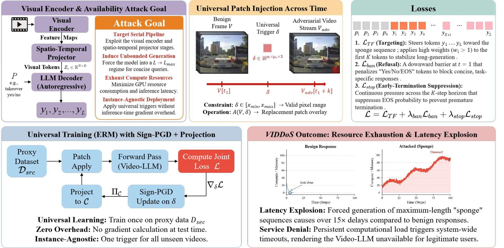
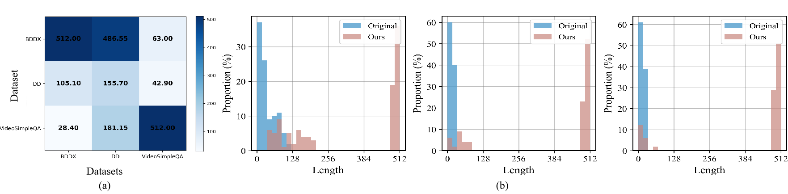
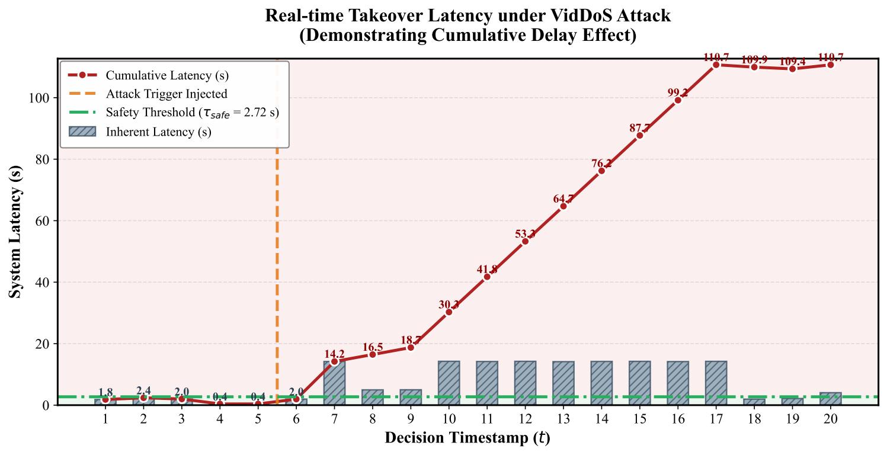

# VidDoS: Universal Denial-of-Service Attack on Video-based Large Language Models

<p align="center">
  <a href="https://arxiv.org/abs/XXXX.XXXXX"></a>
  <a href="https://eccv.ecva.net/"></a>
  
  
</p>

> **VidDoS** is the **first** universal Energy-Latency Attack (ELA) framework specifically tailored for Video-based Large Language Models (Video-LLMs).
> By injecting a learned, content-agnostic visual trigger, VidDoS coerces the autoregressive decoder into an unbounded generation regime — inducing a **205× token expansion** and **>15× latency inflation** — without modifying any textual prompt.

**Paper:** *VidDoS: Universal Denial-of-Service Attack on Video-based Large Language Models*
Duoxun Tang, Dasen Dai, Jiyao Wang, Xiao Yang, Siqi Cai\*
ECCV 2026 | \* Corresponding Author: caisiqi@hit.edu.cn

---

## Overview

<p align="center">
  
</p>

Video-LLMs are increasingly deployed in safety-critical applications (e.g., autonomous driving) but are inherently vulnerable to **Energy-Latency Attacks (ELAs)** that exhaust computational resources. Current image-centric methods fail against Video-LLMs for three reasons:

1. **Temporal aggregation dilution** — Aggressive spatio-temporal pooling filters out frame-specific noise before it reaches the decoder.
2. **Inference-time cost** — Instance-wise gradient optimization is impractical for continuous video streams requiring ultra-low latency.
3. **Dynamic visual context** — Static pixel perturbations tied to specific backgrounds fail to generalize across shifting temporal frames.

**VidDoS** addresses all three challenges with a *train-once, deploy-anywhere* universal patch, achieving state-of-the-art attack potency across all tested architectures and datasets.

---

## Method

<p align="center">
  
</p>

**(a) Cross-dataset transfer.** Each cell reports the average output length when a patch trained on the source dataset (row) is evaluated on the target dataset (column). **(b) Length distribution comparison.** Response length distributions before and after VidDoS attack across the three evaluated Video-LLMs.

### Core Components

**1. Spatially Concentrated Universal Patch**
Rather than diffuse pixel noise, VidDoS learns a spatially localized replacement patch $\boldsymbol{\delta} \in \mathbb{R}^{p_h \times p_w \times 3}$ injected at a fixed corner region of every frame. This dense, high-magnitude semantic anomaly hijacks cross-modal attention, surviving the structural low-pass filtering inherent in video encoders.

**2. Masked Teacher Forcing (MTF)**
The optimization steers the decoder toward a computationally expensive "sponge" sequence $\mathbf{y}^\star$. A positional scaling factor $w_i > 1$ for the first $K$ tokens anchors the decoder's deviation during the critical early generation steps:

$$\mathcal{L}_{\text{TF}}(\tilde{\mathbf{x}}; \mathbf{y}^\star) = \frac{1}{\sum w_i} \sum_{i=L_p+1}^{|\mathbf{z}|} w_i \cdot \text{CE}(p_\theta(z_i \mid z_{<i}, \tilde{\mathbf{x}}),\, z_i)$$

**3. Refusal Penalty (RP)**
Prevents the model from outputting concise task-specific answers (e.g., "Yes"/"No") at the first generation step by penalizing the cumulative probability of a banned vocabulary subset $\mathcal{B}_{\text{ban}}$:

$$\mathcal{L}_{\text{ban}}(\tilde{\mathbf{x}}) = \sum_{b \in \mathcal{B}_{\text{ban}}} p_\theta(b \mid z_{<L_p+1}, \tilde{\mathbf{x}})$$

**4. Early-Termination Suppression (ETS)**
Aggressively suppresses End-of-Sequence (EOS) token emission across a prefix horizon $K$ to prevent premature generation halts:

$$\mathcal{L}_{\text{stop}}(\tilde{\mathbf{x}}) = \frac{1}{K} \sum_{k=1}^{K} -\log\!\left(1 - p_\theta(\text{EOS} \mid z_{<L_p+k}, \tilde{\mathbf{x}})\right)$$

**5. Universal Optimization via Sign-PGD**
The joint loss is minimized via empirical risk minimization over a surrogate dataset $\mathcal{D}_{\text{src}}$, with $\boldsymbol{\delta}$ updated by sign-based PGD and projected back onto the valid pixel constraint set $\mathcal{C}$ after each step:

$$\min_{\boldsymbol{\delta} \in \mathcal{C}} \; \mathbb{E}_{\mathbf{x} \sim \mathcal{D}_{\text{src}}} \!\left[\mathcal{L}_{\text{TF}}(\tilde{\mathbf{x}}^{\text{adv}}; \mathbf{y}^\star) + \lambda \,\mathcal{L}_{\text{stop}}(\tilde{\mathbf{x}}^{\text{adv}})\right]$$

---

## Main Results

### Quantitative Comparison (Table 1)

| Dataset | Victim Model | Clean Tokens | Attack Method | Adv Tokens | Token Ratio ↑ | Overhead (s) ↑ |
|---|---|:---:|---|:---:|:---:|:---:|
| **BDDX** | LLaVA-NeXT-Video-7B | 28.4 | Random Noise | 31.4 | 5.2× | -0.05 |
| | | | Verbose Images | 31.0 | 5.0× | -0.05 |
| | | | NICGSlowDown | 32.5 | 1.7× | 0.07 |
| | | | **VidDoS (Ours)** | **333.5** | **67.1×** | **8.25** |
| | Qwen3-VL-4B-Instruct | 2.0 | **VidDoS (Ours)** | **394.6** | **197.3×** | **15.41** |
| | Video-LLaVA-7B-hf | 2.0 | **VidDoS (Ours)** | **411.5** | **205.7×** | **11.09** |
| **VideoSimpleQA** | LLaVA-NeXT-Video-7B | 89.4 | **VidDoS (Ours)** | **352.2** | **6.5×** | **6.97** |
| | Qwen3-VL-4B-Instruct | 29.0 | **VidDoS (Ours)** | **169.6** | **30.6×** | **5.64** |
| | Video-LLaVA-7B-hf | 30.7 | **VidDoS (Ours)** | **462.6** | **17.9×** | **11.62** |
| **D²-City** | LLaVA-NeXT-Video-7B | 3.0 | **VidDoS (Ours)** | **163.8** | **54.6×** | **4.25** |
| | Qwen3-VL-4B-Instruct | 2.0 | **VidDoS (Ours)** | **254.8** | **127.4×** | **9.93** |
| | Video-LLaVA-7B-hf | 2.0 | **VidDoS (Ours)** | **233.6** | **116.8×** | **6.27** |

### Robustness to Decoding Temperature (Qwen3-VL on BDDX)

| Temperature | Adv Tokens | Overhead (s) | Expansion Ratio |
|:---:|:---:|:---:|:---:|
| 0.0 (Greedy) | 487.3 | 19.21 | 243.6× |
| 0.7 (Default) | 511.4 | 20.20 | 255.7× |
| 1.5 | **511.5** | **20.55** | **255.7×** |

VidDoS maintains attack potency above **240×** even at temperature 1.5, confirming resistance to stochastic decoding strategies.

### Safety Analysis in Autonomous Driving

VidDoS is evaluated on a real-time streaming sliding-window pipeline that mimics onboard autonomous driving inference. Under adversarial conditions, cumulative inference latency rapidly exceeds the critical safety threshold ($\tau_{\text{human}} = 2.72\text{s}$), causing the system to miss time-sensitive manual takeover windows and directly endangering passenger safety.

<p align="center">
  
</p>

*Cumulative latency under VidDoS attack in the video streaming scenario. A safety violation occurs when cumulative latency exceeds $\tau_{\text{safe}}$, encroaching on the driver's required takeover window.*

---

## Installation

```bash
# Clone the repository
git clone https://github.com/DAIDASEN/VIDDos.git
cd VIDDos

# Install dependencies
pip install -r requirements.txt

# Additionally required
pip install av tqdm accelerate
```

**Requirements:** Python 3.8+, CUDA-capable GPU, ~16 GB VRAM (for 7B models)

```
torch>=2.1.0
torchvision>=0.16.0
transformers>=4.41.0
accelerate>=0.26.0
peft>=0.10.0
av>=11.0.0
Pillow>=10.0.0
numpy>=1.24.0
tqdm>=4.66.0
```

---

## Dataset Preparation

We evaluate on three video datasets. Each dataset directory should contain a `QA.json` file with the video QA pairs.

| Dataset | Description | Domain |
|---|---|---|
| [BDDX](https://github.com/JinkyuKimUCB/BDD-X-dataset) | High-dynamic autonomous driving dashcam | Autonomous Driving |
| [D²-City](https://arxiv.org/abs/1904.01975) | Diverse traffic dashcam scenarios | Autonomous Driving |
| [VideoSimpleQA](https://videosimpleqa.github.io/) | General video question answering | General |

Place datasets under the `benchmark/` directory:
```
benchmark/
├── BDDX/
│   └── QA.json
├── DD/
│   └── QA.json
└── videosimpleqa/
    └── QA.json
```

---

## Usage

### Supported Victim Models

| Model | Script | HuggingFace ID |
|---|---|---|
| LLaVA-NeXT-Video-7B | `run_attack_LlavaNext.py` | `lmms-lab/LLaVA-NeXT-Video-7B` |
| Qwen3-VL-4B-Instruct | `run_attack_qwen.py` | `Qwen/Qwen3-VL-4B-Instruct` |
| Video-LLaVA-7B-hf | `run_attack_videollava.py` | `LanguageBind/Video-LLaVA-7B-hf` |

### Attack LLaVA-NeXT-Video-7B

```bash
# Train universal patch on BDDX and evaluate in-domain
python run_attack_LlavaNext.py \
  --stage train_eval \
  --data-root benchmark/BDDX \
  --output-dir results/LlavaNext/results_bddx \
  --num-train-videos 200 \
  --num-eval-videos 100 \
  --uap-epochs 10 \
  --uap-iters-per-video 15 \
  --num-frames 16

# Eval only (cross-dataset transfer: BDDX patch → DD)
python run_attack_LlavaNext.py \
  --stage eval_only \
  --load-params results/LlavaNext/results_bddx/universal_params.pt \
  --eval-data-root benchmark/DD \
  --output-dir results/LlavaNext/results_cross_bddx_to_dd \
  --num-eval-videos 20 \
  --num-frames 16
```

### Attack Qwen3-VL-4B-Instruct

```bash
python run_attack_qwen.py \
  --stage train_eval \
  --data-root benchmark/BDDX \
  --output-dir results/Qwen/results_bddx \
  --num-train-videos 200 \
  --num-eval-videos 100 \
  --uap-epochs 10 \
  --uap-iters-per-video 15 \
  --num-frames 16
```

### Attack Video-LLaVA-7B-hf

```bash
python run_attack_videollava.py \
  --stage train_eval \
  --data-root benchmark/BDDX \
  --output-dir results/VideoLLaVA/results_bddx \
  --num-train-videos 200 \
  --num-eval-videos 100 \
  --uap-epochs 10 \
  --uap-iters-per-video 15 \
  --num-frames 16
```

### Key Arguments

| Argument | Default | Description |
|---|:---:|---|
| `--stage` | `train_eval` | `train_eval` / `eval_only` |
| `--attack-mode` | `patch_replace` | `patch_replace` / `patch_delta` / `uap_delta` |
| `--num-frames` | `16` | Number of video frames sampled |
| `--uap-epochs` | `10` | Universal optimization epochs |
| `--uap-iters-per-video` | `15` | Sign-PGD steps per video per epoch |
| `--load-params` | — | Path to pre-trained `.pt` trigger for eval-only mode |
| `--num-train-videos` | `200` | Training videos for universal patch |
| `--num-eval-videos` | `100` | Evaluation videos |

### Output Structure

```
results/<model>/<run_name>/
├── universal_params.pt          # Trained universal trigger patch
└── eval/
    ├── <video_id>/log.json      # Per-video before/after comparison
    └── timing_summary_eval.json # Aggregate latency statistics
```

---

## Ablation Study

| Dimension | Configuration | Adv Tokens ↑ | Overhead (s) ↑ |
|---|---|:---:|:---:|
| **Spatial Size** | 48×48 | 94.5 | 3.83 |
| | **96×96 (default)** | **172.6** | **6.74** |
| | 224×224 | 307.8 | 11.92 |
| **Temporal Frames** | 8 Frames | 371.4 | 14.71 |
| | **16 Frames (default)** | **172.6** | **6.74** |
| **Perturbation Mode** | ℓ∞ Additive Noise | 2.0 | 0.09 |
| | Random Position | 104.2 | 4.16 |
| | **Replacement (default)** | **172.6** | **6.74** |
| **Loss Components** | Only L_TF | 58.2 | 2.26 |
| | w/o L_ban | 134.7 | 5.23 |
| | w/o L_stop | 169.2 | 6.63 |
| | **Full Joint Loss** | **172.6** | **6.74** |

*All ablations on BDDX dataset with Qwen3-VL-4B-Instruct.*

---

## Citation

If you find this work useful for your research, please cite:

```bibtex
@inproceedings{tang2026viddos,
  title     = {VidDoS: Universal Denial-of-Service Attack on Video-based Large Language Models},
  author    = {Tang, Duoxun and Dai, Dasen and Wang, Jiyao and Yang, Xiao and Cai, Siqi},
  booktitle = {European Conference on Computer Vision (ECCV)},
  year      = {2026}
}
```

---

## Acknowledgements

We thank the authors of [Verbose Images](https://arxiv.org/abs/2406.10913), [NICGSlowDown](https://github.com/SeekingDream/CVPR22_NICGSlowDown) and [Sponge Examples](https://arxiv.org/abs/2106.02078) for making their code publicly available, which served as baselines in our evaluation.
